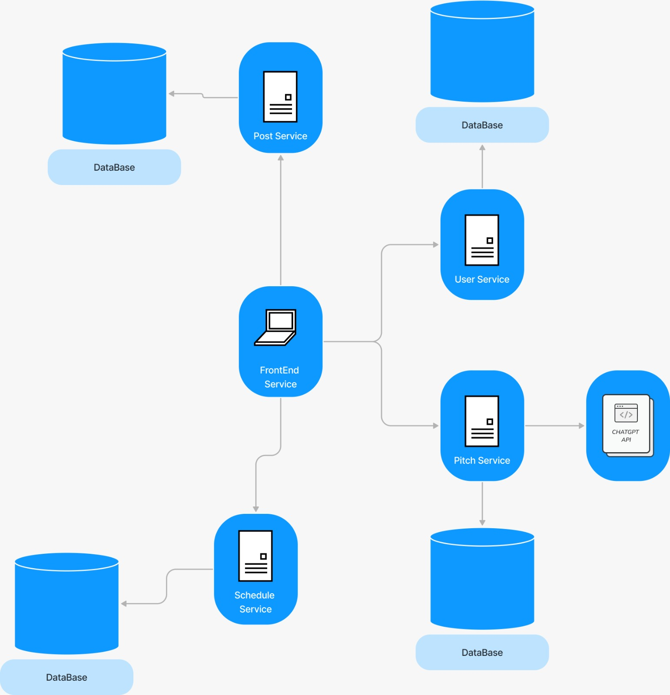

# Documento de Arquitetura de Software

## Visão Geral

Este documento descreve a arquitetura de software para um projeto que utiliza o React no frontend, quatro microsserviços implementados com FastAPI e um banco de dados para cada microsserviço. A arquitetura foi projetada para ser escalável, resiliente e de alto desempenho. A arquitetura do sistema é baseada em uma abordagem de microsserviços, onde diferentes componentes são separados em serviços independentes e interagem através de interfaces bem definidas. A seguir, apresenta-se um esboço da arquitetura em alto nível:

<figcaption style="text-align: center !important">
    Fonte: Próprio autor
  </figcaption>
</figure>

## Componentes
### Frontend
O frontend da aplicação será desenvolvido utilizando o React, um framework JavaScript para a construção de interfaces de usuário. As principais motivações e vantagens para a escolha do React incluem:

#### Componentização
O React permite a criação de componentes reutilizáveis, o que facilita a manutenção e a escalabilidade do código. Cada componente tem sua própria lógica e é responsável por renderizar uma parte do interface de usuário.

#### Desempenho
O React utiliza um algoritmo de reconciliação eficiente e um DOM virtual para limitar as atualizações do DOM real, o que melhora significativamente o desempenho e reduz o consumo de dados.

#### Flexibilidade
O React é flexível e pode ser integrado com outras bibliotecas ou frameworks, como Redux para gerenciamento de estado.

### Microsserviços
Será utilizado uma arquitetura de microsserviços devido a sua escalabilidade, resiliência e facilidade de manutenção. Os microsserviços serão implementados utilizando o <Ferramenta>. Cada microsserviço será responsável por uma funcionalidade específica da aplicação e se comunicará com os outros microsserviços através de APIs RESTful.
As principais características dos microsserviços incluem:

#### Desacoplamento
Cada microsserviço é independente dos outros, o que permite que eles sejam desenvolvidos, testados, implantados, escalados e atualizados de forma independente.

#### Organização em torno das capacidades de negócio
Cada microsserviço é responsável por uma funcionalidade específica que corresponde a uma capacidade de negócio.

#### Autonomia
Cada microsserviço é autônomo, o que significa que ele pode ser desenvolvido por uma equipe pequena e independente que é responsável por todo o ciclo de vida do serviço.

#### Tecnologia heterogênea
Como cada microsserviço é independente, eles podem ser desenvolvidos utilizando diferentes tecnologias, o que permite que cada equipe escolha a tecnologia que melhor se adapta às suas necessidades.

#### Resiliência
Como cada microsserviço é independente, a falha de um serviço não afeta diretamente os outros. Isso aumenta a resiliência do sistema como um todo.

#### Escalabilidade
Como cada microsserviço pode ser escalado de forma independente, é possível escalar apenas os serviços que necessitam de mais recursos, o que pode levar a um uso mais eficiente dos recursos.

Os microsserviços identificados para aplicação são:
#### Usuários
Serviço responsável por gerenciar os usuários da aplicação, incluindo cadastro, autenticação e autorização.

#### Gerador de pitch
Serviço responsável por gerar o pitch a patir de dados fornecidos pelo usuário.

#### Post
Serviço responsável por postar os pitchs gerados no linkedin e instagram.

#### Agendamento
Serviço responsável por agendar as postagens criadas pelo usuário.

Será utilizado o SOLID (Single Responsibility, Open-Closed, Liskov Substitution, Interface Segregation e Dependency Inversion) para garantir a qualidade do código, facilitar a manutenção e evolução do projeto.

Para padrões de projeto, serão utilizados os padrões:
#### Criador
O padrão criador será utilizado para garantir a obrigatoriedade da hierarquia de instanciações de objetos, assegurando que nenhum objeto criado de forma incorreta, permitindo a criação e utilização apenas dos objetos necessários.

#### Especialista
Associada a granularidade de cada microsserviço, permitirá que cada serviço/entidade do projeto cumpra com as regras de negócio estabelecidas de forma específica e modular.

#### Facade
Com esse padrão, o usuário poderá realizar tarefas complexas que utilizam várias classes de forma mais simples, sem precisar conhecer a complexidade do sistema.

### Banco de Dados
<!-- #### DER
O Diagrama de Entidade-Relacionamento (DER) é uma ferramenta utilizada para modelar os dados de um sistema de forma conceitual. O DER é composto por entidades, atributos, relacionamentos entre as entidades e suas cardinalidades. O DER é uma ferramenta poderosa para a modelagem de dados, pois permite visualizar e entender a estrutura dos dados de um sistema de forma clara. O DER identificado para o projeto é:

<figcaption style="text-align: center !important">
    Fonte: Próprio autor
  </figcaption> -->

## Considerações de Segurança

A segurança é uma preocupação primordial em nossa plataforma de marketing digital. Implementamos diversas medidas para garantir a proteção dos dados e a integridade do sistema:

- **Autenticação e Autorização em Microsserviços**: Todos os microsserviços foram configurados com sistemas robustos de autenticação e autorização para controlar o acesso aos recursos protegidos. Utilizamos tecnologias como OAuth2 e JWT (JSON Web Tokens) para garantir que apenas usuários autorizados possam acessar as funcionalidades da plataforma.

- **Conexões Seguras (HTTPS)**: Para todas as comunicações entre os componentes da plataforma, utilizamos exclusivamente conexões seguras HTTPS. Isso garante que todas as informações transmitidas entre os servidores e os clientes sejam criptografadas e protegidas contra interceptação por parte de terceiros.

- **Práticas de Codificação Segura**: Adotamos rigorosas práticas de codificação segura em todo o desenvolvimento da plataforma. Isso inclui a implementação de validação adequada de entrada e saída de dados, prevenindo vulnerabilidades comuns, como injeção de SQL, XSS (Cross-Site Scripting) e CSRF (Cross-Site Request Forgery).

Essas medidas combinadas garantem que nossa plataforma seja altamente resiliente a ataques e que os dados dos usuários e projetos universitários sejam protegidos de forma eficaz contra ameaças cibernéticas. Estamos comprometidos em manter e aprimorar continuamente a segurança da plataforma para garantir a confiança e a privacidade dos nossos usuários.

## Considerações de Escalabilidade

A arquitetura proposta foi planejada para suportar escalabilidade horizontal dos microsserviços, permitindo a adição de mais instâncias dos serviços conforme necessário para lidar com aumentos de carga. No que diz respeito ao banco de dados no   NOME_DO_BANCO, a escalabilidade vertical e horizontal é suportada pelo serviço de banco de dados escolhido, como o NOME_DO_BANCO_SQL. Recomenda-se, portanto, explorar as opções fornecidas pela plataforma para dimensionar o banco de dados de acordo com as necessidades do sistema.

Ademais, é imprescindível considerar a implementação de técnicas de balanceamento de carga e distribuição de trabalho entre os microsserviços, a fim de garantir uma distribuição equilibrada da carga e evitar pontos únicos de falha. O uso de cache para armazenar dados frequentemente acessados e a utilização de serviços de fila de mensagens para processamento assíncrono também podem contribuir significativamente para melhorar a escalabilidade e a resiliência do sistema.

Por fim, ressaltamos a importância de realizar testes de desempenho e escalabilidade em diferentes cenários de carga, a fim de avaliar o comportamento do sistema e identificar potenciais gargalos ou pontos de otimização. A escalabilidade deve ser considerada como um aspecto contínuo do desenvolvimento e operação da plataforma, com monitoramento constante e ajustes conforme necessário, garantindo assim que o sistema possa crescer de forma eficiente e sustentável.

## Considerações de Tolerância a Falhas

A arquitetura proposta busca ser resiliente a falhas, permitindo que o sistema continue operando mesmo em caso de falha de um ou mais componentes. Para garantir essa resiliência, foram implementadas as seguintes práticas:

- **Implementação de Mecanismos de Recuperação Automática**: Os microsserviços foram configurados com mecanismos de recuperação automática, como a reinicialização automática de contêineres em caso de falhas. Isso ajuda a garantir que os serviços possam se recuperar rapidamente de falhas inesperadas e minimizar o impacto sobre a operação do sistema como um todo.

- **Configuração de Pontos de Extremidade de Monitoramento e Sondagem**: Foram configurados pontos de extremidade de monitoramento e sondagem para verificar a disponibilidade e o estado dos microsserviços. Esses pontos de extremidade permitem que os sistemas de monitoramento e alerta identifiquem rapidamente problemas de disponibilidade ou desempenho e tomem as medidas necessárias para mitigar os impactos.

- **Utilização de Estratégias de Repetição de Mensagens**: Para lidar com falhas temporárias na comunicação entre os componentes, foram implementadas estratégias de repetição de mensagens. Essas estratégias permitem que as mensagens sejam reenviadas automaticamente em caso de falhas de comunicação, garantindo que as operações críticas sejam concluídas mesmo em condições adversas.

Essas práticas combinadas garantem que a plataforma seja capaz de lidar com falhas de forma eficaz, mantendo a disponibilidade e a integridade das operações mesmo em situações adversas. A tolerância a falhas é um aspecto crucial da arquitetura do sistema.

## Considerações de Manutenção

A manutenção do sistema é uma consideração importante para garantir a confiabilidade e a estabilidade a longo prazo. Algumas práticas recomendadas incluem:

- **Implementação de Testes Automatizados**: Os microsserviços foram desenvolvidos com testes automatizados, abrangendo testes de unidade, testes de integração e testes de aceitação. Esses testes garantem a detecção precoce de regressões e problemas de integração, permitindo uma manutenção mais eficiente e confiável do sistema.

- **Estabelecimento de Processos de Implantação Contínua**: Foram estabelecidos processos de implantação contínua para facilitar a implantação e a atualização dos microsserviços. Com a automação desses processos, as atualizações podem ser entregues de forma rápida e segura, garantindo uma iteração ágil e contínua do sistema.

- **Realização de Backups Regulares do Banco de Dados**: Backups regulares do banco de dado são realizados para garantir a disponibilidade e a recuperação em caso de falhas ou perda de dados. Esses backups são essenciais para garantir a integridade e a continuidade das operações, permitindo a restauração rápida do sistema em caso de incidentes ou desastres.

Essas práticas de manutenção combinadas asseguram que o sistema permaneça confiável, estável e funcional ao longo do tempo, garantindo assim uma experiência consistente e satisfatória para os usuários. A manutenção contínua do sistema é fundamental para garantir sua eficácia e relevância no ambiente em constante evolução da tecnologia.

## Referências

NOGUEIRA, D. L. Ferramentas automatizadas para apoio ao projeto estruturado: uma aplicação do diagrama de entidade-relacionamento. Tese (Doutorado) — Universidade Federal do Rio de Janeiro, Rio de Janeiro, RS, 1988. Tese (Doutorado em Ciências em Engenharia de Sistemas e Computação). 

FRANCK, K. M. .; PEREIRA, R. F. .; DANTAS FILHO, J. V. . Ratio-Entity Diagram: a tool for conceptual data modeling in Software Engineering. Research, Society and Development, 2021.

SARCAR, Vaskaran. Java Design Patterns: A Hands-On Experience with Real-World Examples, 2018.

Padrão para atribuir responsabilidades: Creator. Disponível em: http://www.dsc.ufcg.edu.br/~jacques/cursos/map/html/pat/creator.htm . Acesso em: 09 de abril de 2024.

Padrão para atribuir responsabilidades: Expert. Disponível em: http://www.dsc.ufcg.edu.br/~jacques/cursos/map/html/pat/expert.htm . Acesso em: 09 de abril de 2024.

## Histórico de versão

|  Data  |   Versão   | Descrição |Autor(es)
|:------:|-----------:|:-------:|:---:|
| 14/05/2024 | 1.0 | Criação | [Lucas](https://gitlab.com/mibasFerraz)|