# **Lean Inception**

## Histórico de versão
| Data | Versão | Descrição | Autor(es) |
| ---- | ---- | ---- | ---- |
| 06/05/2024 | 0.1 | Criação do Documento | Douglas Farias |
| 07/05/2024 | 0.2 | Descrição das atividades realizadas e seus resultados | Douglas Farias |

## **1. Introdução**
A Lean Inception representa uma metodologia ágil que mescla o melhor do Design Thinking, com seu foco no usuário e na inovação, e do Lean Startup, que prioriza a eficiência e a economia de recursos, para criar uma estratégia focada na definição e no desenvolvimento do Produto Mínimo Viável (MVP). Essa abordagem é realizada por meio de um workshop intensivo, geralmente conduzido ao longo de uma semana, dividido em várias sessões e atividades interativas.

Adotando a sequência de atividades proposta pela Lean Inception, realizamos reuniões ao longo de cinco dias via plataforma Discord para definir o escopo e objetivo do projeto de Marketing Digital da disciplina EPS, o Pitch It. Nossa equipe identificou os usuários e suas necessidades, definiu objetivos de negócio, levantou e priorizou funcionalidades, chegando ao MVP do Pitch It, foco desta documentação.

Durante o processo do Lean Inception, realizamos as dinâmicas: 
- Visão do Produto, 
- Produto É, Não É, Faz, Não Faz
- Definição de Objetivos do Produto
- Criação de Personas
- Mapeamento da Jornada do Usuário
- Brainstorming de funcionalidades
- Revisões técnica, de negócio e de UX
- Sequenciador
- Canvas MVP
  
### **Agenda**

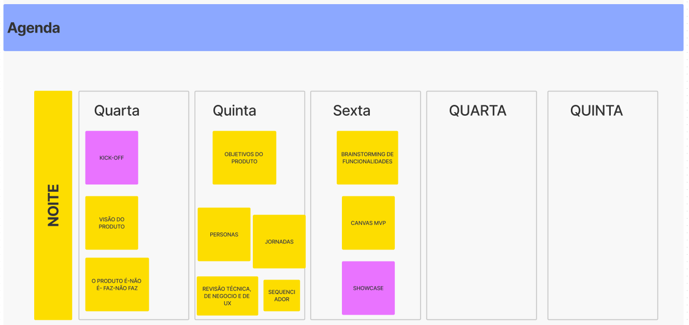

## **2. Visão do Produto**
Essa foi a etapa inicial da definição da Visão do Produto para o nosso projeto. Seguindo a recomendação, dividimos a equipe em três grupos, e cada um elaborou sua Visão do Produto usando o template disponibilizado. Ao final, discutimos as similaridades e diferenças entre os dois e unificamos em um que contemplasse o projeto. Esse processo nos permitiu não apenas estabelecer uma direção clara para o desenvolvimento do produto, mas também promoveu uma compreensão compartilhada entre toda a equipe.

### **Resultado**
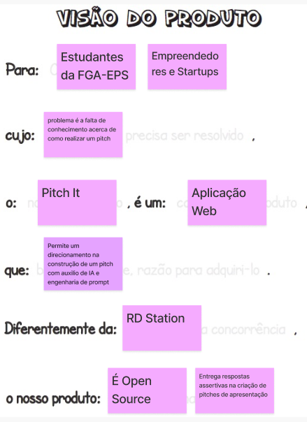

## **3. É Não É, Faz Não faz**
Concluímos a atividade "_É - Não é - Faz - Não faz_" como parte da definição de produto. Nessa etapa seguimos os seguintes passos recomendados:
1. Separamos a equipe em dois grupos
2. Uma equipe focou suas ideias em descrever o que o produto _É_ e o que _Não é_, e o outro grupo focou no que o produto _Faz_ e o que _Não Faz_
3. Cada integrante do grupo escreveu nos post-it o que entendia sobre o produto
4. Em seguida, revisamos e organizamos os post-its em grupos de ideias similares
5. Por fim, unificamos as ideias no quadro _É - Não é - Faz - Não faz_
 
### **Resultado**
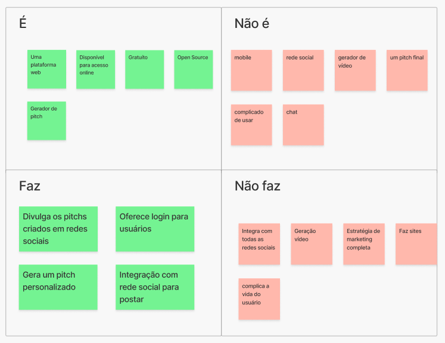

## **4. Objetivos do Produto**
Na definição dos Objetivos do Produto, todos da equipe compartilharam suas visões sobre o que é essencial para o produto. Cada integrante responde a pergunta _"Se você tiver que resumir o produto em três objetivos para o negócio, quais seriam eles?"_ com três ou mais respostas. Logo após, compartilhamos nossas ideias e agrupamos conforme a similaridade entre elas.
Em seguida, trabalhamos para refinar e consolidar esses objetivos. Durante esse processo, identificamos e removemos sugestões que não se alinhavam com os verdadeiros objetivos do produto. Por fim, demos nomes aos cluster para cada tipo de objetivo, o que ajudou a definir cada um dos tipos de objetivos do nosso produto.

### **Resultado**
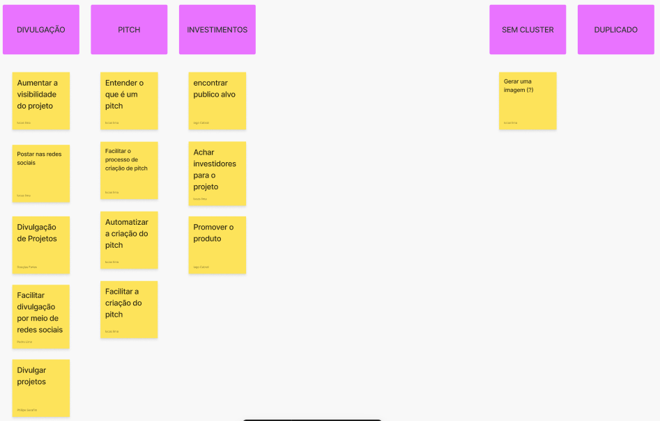

## **5. Personas**
Essa foi a etapa em que elaboramos as personas do nosso projeto, entendendo as necessidades e as expectativas dos nossos usuários finais. Seguimos os seguintes passos para realizar a atividade:

1. Organizamos a equipe em três grupos, onde cada um esboçou uma persona considerando suas necessidades e expectativas
2. Em seguida, cada grupo compartilhou a persona criada com o restante da equipe, oferecendo detalhes sobre quem ela é, suas necessidades e como o produto se encaixará na sua realidade
3. Mudanças foram sugeridas e executadas, alinhando suas necessidades e expectativas

Essa atividade nos ajudou a criar personas relevantes para o projeto e também fortaleceu a empatia da equipe em relação aos usuários finais.

### **Resultado**
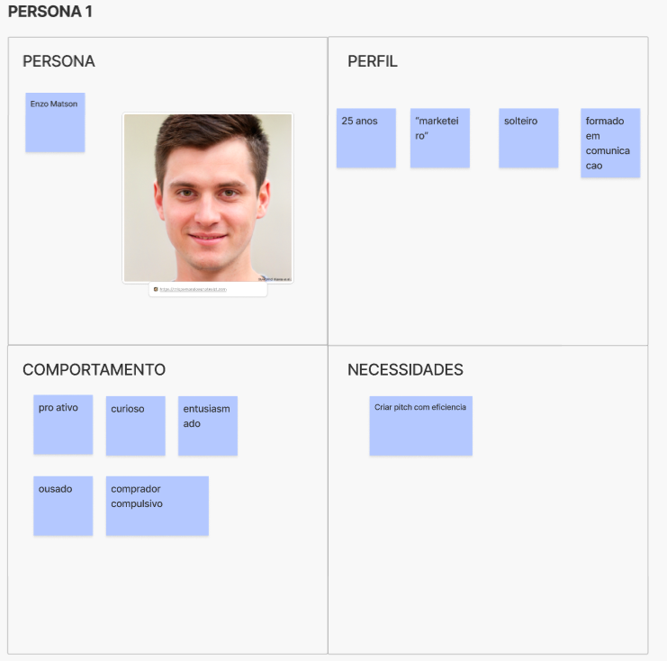
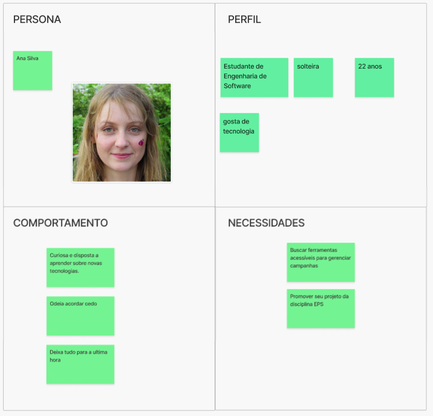

## **6. Jornadas do Usuário**
A Jornada do Usuário foi fundamental para compreendermos as diferentes etapas de interação dos usuários com nosso produto, desde o primeiro contato até a utilização contínua e possíveis momentos de abandono. Essa atividade nos proporcionou insights importantes sobre os momentos em que os usuários utilizarão nossa aplicação.

### **Resultado**
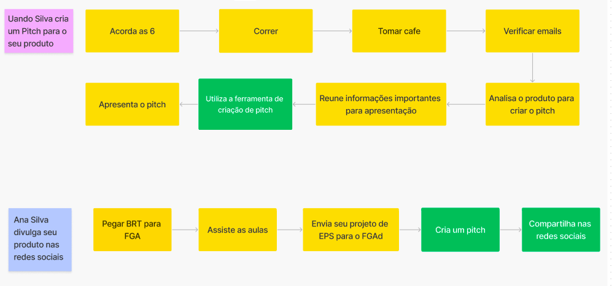

## **7. Brainstorming de Funcionalidades**
No Brainstorming de Funcionalidades definimos e descrevemos o que os usuários poderão realizar no Pitch It. Focamos em garantir que cada funcionalidade cumpra um objetivo de negócio específico, atenda a uma necessidade identificada da persona ou se integre a um momento específico na jornada do usuário.

Seguimos a metodologia sugerida para facilitar o brainstorming:

1. Definimos um timebox de 5 minutos para cada integrante da equipe escrever todas as ideias que tinham a respeito das funcionalidades do Pitch It
2. Em seguida, passamos por cada uma das funcionalidades agrupando as por similaridade
3. Algumas funcionalidades precisaram de mais atenção e foram explicadas por quem as escreveu e os demais membros do equipe sugeriram possíveis mudanças para se alinhar aos objetivos do projeto.
4. Por fim, agrupamos em clusters cada uma das funcionalidades

Essa atividade nos ajudou a levantar uma lista de funcionalidades que atendem às necessidades e expectativas dos nossos usuários.

### **Resultado**
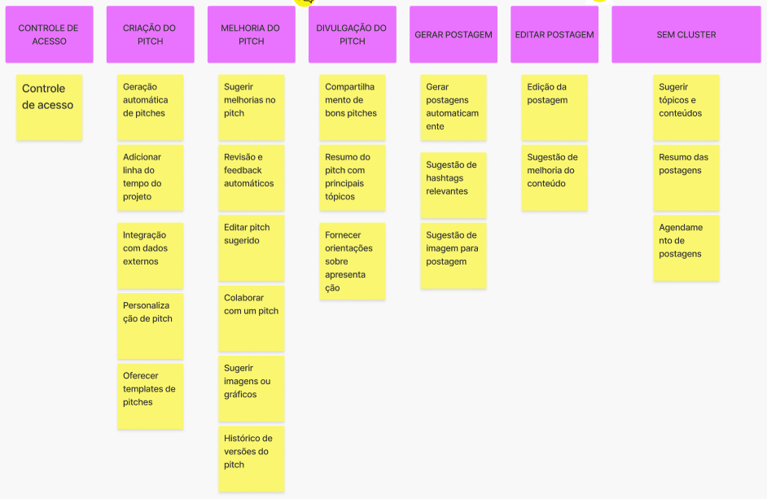

## **8. Revisão técnica, de negocios e de UX**
A revisão das funcionalidades garantiu o alinhamento da equipe em relação aos aspectos técnicos, de negócio e de experiência do usuário (UX). O objetivo desta atividade foi capturar novas perspectivas e tornar mais claro a viabilidade das funcionalidades do projeto.

Seguimos o processo abaixo para realizar essa revisão:

1. Pegamos uma funcionalidade para passar pelo gráfico e tabela de revisão.

2. Definimos uma cor que representou o nível de confiança da equipe em relação a essa funcionalidade e marcamos os valores de negócio, esforço e valor de UX em uma escala de 1 a 3, utilizando símbolos como $, E e ♥, respectivamente.

3. Após a marcação, confirmamos se todos na equipe estavam de acordo com a avaliação realizada. Em seguida, escolhemos outra funcionalidade para repetir o processo a partir do passo 1.

Esse método permitiu uma revisão das funcionalidades do produto, identificando as áreas onde há consenso ou discordância sobre o valor e a viabilidade de cada funcionalidade.

### **Resultado**
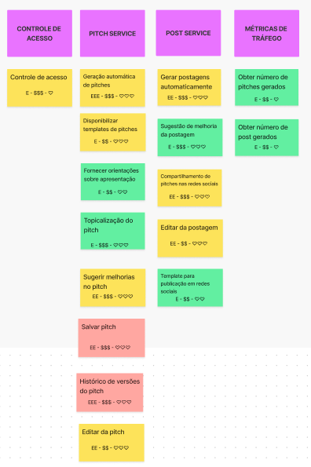

## **9. Sequenciador**
Na etapa de Sequenciamento das Funcionalidades do nosso produto, organizamos as funcionalidades em uma sequência de implementação dividida por ondas. O Sequenciador considerou vários fatores, como o impacto no usuário, a complexidade técnica e as restrições de tempo e recursos. Isso nos permite planejar o desenvolvimento de forma a entregar valor ao usuário de maneira incremental, focando nos aspectos mais importantes do produto e garantindo que cada etapa contribua para melhorar sua experiência e alcançar nossos objetivos de negócio.

### **Resultado**
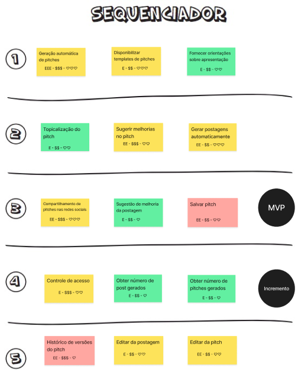

### **10. Canva MVP**
A última etapa é a elaboração do Canva MVP para o nosso projeto, uma ferramenta visual que nos ajudou a definir e alinhar a estratégia do Produto Mínimo Viável (MVP). O Canvas MVP representa a versão mais básica do produto que atende às necessidades do negócio e pode ser validada pelo usuário final.

Segue o procedimento que utilizamos para criar o Canvas MVP:

1. Dividimos a equipe em dois grupos e fornecemos a cada grupo o seu próprio template do Canvas MVP.
2. Solicitamos que cada grupo preenchesse o Canvas MVP com suas ideias e estratégias.
3. Após a conclusão, cada grupo apresentou seu Canvas MVP ao restante da equipe.
4. Realizamos uma sessão de consolidação, na qual trabalhamos juntos para revisar e ajustar os sete blocos do Canvas MVP, garantindo que a estratégia geral do MVP fosse coesa e abordasse todas as áreas importantes do produto.

### **Resultado**
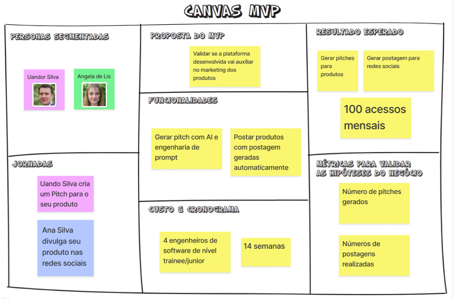

## Bibliografia

> [Documento de Lean Inception Neural Trade](https://gitlab.com/fga-eps-rmc/neuraltrade/neuraltrade_doc/-/blob/main/documentos/leanInception.md?ref_type=heads)

> CAROLI, P. Lean Inception. [s.l.] Editora Caroli, 2019.

